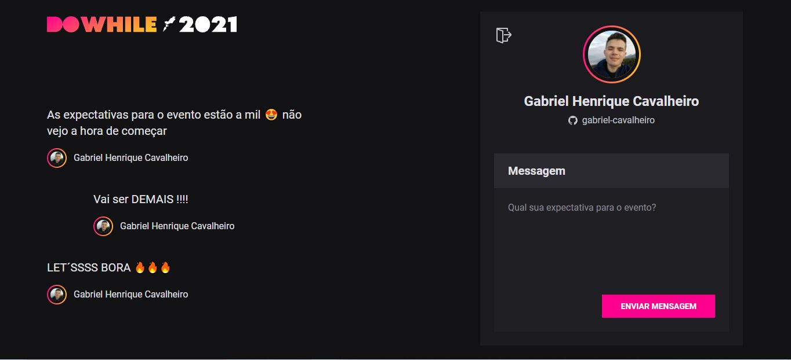

<h1 align="center">NLW Heat</h1>

  <a href="#-tecnologias">Tecnologias</a>&nbsp;&nbsp;&nbsp;|&nbsp;&nbsp;&nbsp;
  <a href="#-como-executar">Como executar</a>&nbsp;&nbsp;&nbsp;|&nbsp;&nbsp;&nbsp;
  <a href="#-licença">Licença</a>

  
  

## ✨ Tecnologias

Esse projeto foi desenvolvido com as seguintes tecnologias:

- [ReactJs](https://pt-br.reactjs.org/)
- [NodeJs](https://nodejs.org/en/docs/)
- [TypeScript](https://www.typescriptlang.org/)
- [Vite](https://vitejs.dev/)
- [Express](https://expressjs.com/pt-br/)
- [Prisma](https://www.prisma.io/)
- [SQLite](https://www.sqlite.org/index.html)
- [JSON Web Token](https://jwt.io/)
- [Socket.IO](https://socket.io/)
- [Sass](https://sass-lang.com/)
- [React Icons](https://react-icons.github.io/react-icons/)

## 🚀 Como executar o Back-end

> Obs.: Nesse projeto temos autenticação via OAuth com o GitHub
- Clone o repositório e acesse a pasta;
- Faça uma copia do arquivo `.env.example` para `.env` e preencha com as suas credenciais do GitHub;
- Instale as dependências com `yarn`;
- Executa as migrations com `yarn prisma migrate dev`;
- Inicie o servidor com `yarn dev`;

A aplicação pode ser acessada em [`localhost:4000`](http://localhost:4000).

## 🚀 Como executar o Front-end
  
- Instale as dependências com `yarn`;
-  Inicie o servidor com `yarn dev`;
-  A aplicação pode ser acessada em [`localhost:3000`](http://localhost:3000).

## 📄 Licença

Esse projeto está sob a licença MIT. Veja o arquivo [LICENSE](LICENSE) para mais detalhes.

---

Feito com ♥ by Gabriel
